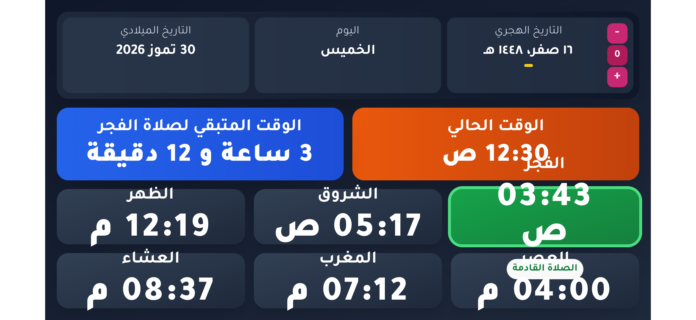

# 🕌 PRTime TV – Ramadi Prayer Times

<div align="center">

واجهة ويب حديثة لعرض مواقيت الصلاة الخاصة بمدينة **الرمادي**، مصممة للشاشات الكبيرة مع تحديث الوقت والعد التنازلي للصلاة القادمة بشكل مباشر.

[](https://prtime-tv.vercel.app/)


### 🌐 التجربة المباشرة

https://prtime-tv.vercel.app/

</div>

---

## 📸 لقطة شاشة

<p align="center">
  
</p>

---

## ✨ المميزات

- 🕒 عرض الوقت الحالي بشكل مباشر.
- 📅 عرض التاريخ الميلادي والهجري.
- 📆 عرض اسم اليوم.
- 🕌 عرض مواقيت الصلوات اليومية لمدينة **الرمادي**.
- 🌅 عرض وقت الشروق.
- ⏳ عد تنازلي مباشر حتى موعد الصلاة القادمة.
- 📌 تمييز الصلاة القادمة تلقائيًا.
- ➕➖ إمكانية تعديل التاريخ الهجري (Hijri Offset).
- 📺 واجهة محسنة للعرض على الشاشات الكبيرة.
- ⚡ تحديث الوقت والبيانات بشكل لحظي.

---

## 🛠️ التقنيات المستخدمة

- React
- TypeScript
- Vite
- Tailwind CSS
- Lucide React

---

## 🚀 التشغيل محليًا

### تثبيت الاعتمادات

```bash
npm install
```

### تشغيل المشروع

```bash
npm run dev
```

### إنشاء نسخة الإنتاج

```bash
npm run build
```

### معاينة نسخة الإنتاج

```bash
npm run preview
```

---

## 🌍 النشر

يمكن نشر المشروع على أي خدمة تدعم المواقع الثابتة، مثل:

- Vercel
- GitHub Pages
- Netlify
- Firebase Hosting

---

## 📄 الترخيص

هذا المشروع مرخص بموجب **MIT License**.

---

<div align="center">

إذا أعجبك المشروع، لا تنسَ ⭐ دعم المستودع.

Made with ❤️ using React + TypeScript + Vite

</div>
